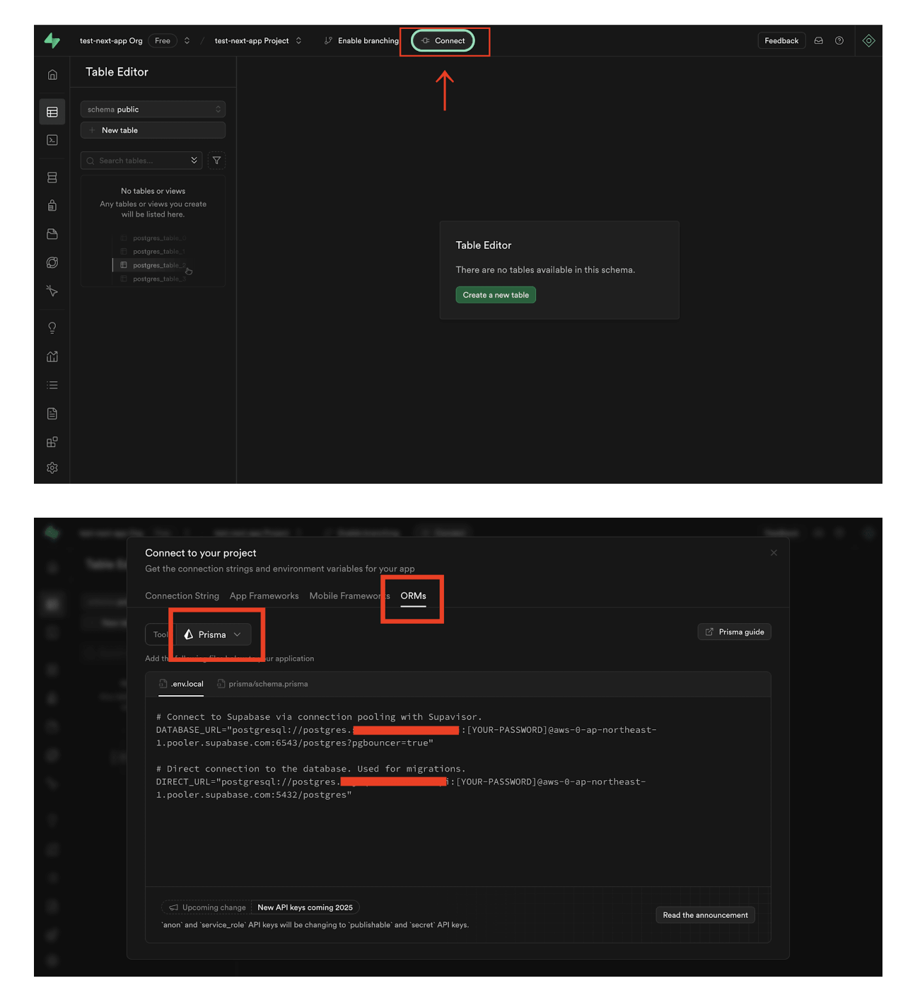

# 解決くん

## Supabese 接続設定

1. env ファイル修正  
   下記スクショを基に.env ファイルの設定値を修正
   

2. 接続先 DB のマイグレーション（初回構築のみ）

   ```bash
   npx prisma migrate dev --name init
   ```

## 開発サーバー起動

```bash
npm run dev
```
